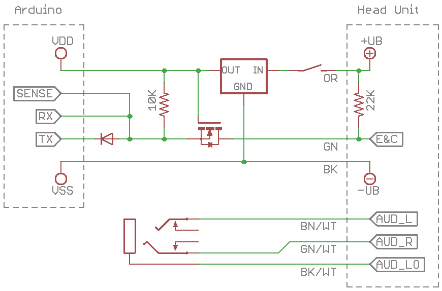

# Schematic

A few things to note:

* The 22k pull-up resistor is likely in the head unit.  Do not add this
  yourself, unless for some reason yours is lacking a pull-up.
* The DC-DC converter is just a representation.  You may need capacitors and
  other feedback circuitry if you use a regulator.  Or if you choose a
  different way to power the device, it may not be necessary at all.

## Connecting the device

I prefer not to cut and splice on a perfectly-good wiring harness, however
splicing into these wires right behind the dash would result in shorter wire
runs and possibly better methods of powering the device.

The six color-coded wires on the right of the schematic go to a 10-pin female
connector near where the cassette deck / CD changer would be mounted.  I've
chosen to make an adapter for this connector and run the six wires back to
some accessible place where I can mount the 3.5mm jack and the on/off switch.

Its pinout and wire colors:

1.  Audio L (Brown/White)
2.  Audio R (Green/White)
3.  Audio Lo (Black/White)
4.  N/C
5.  Battery positive-terminal (Orange)
6.  N/C
7.  Ground (Black)
8.  N/C
9.  N/C
10. E&C Bus (Green)

That connector is the same shape as some of the connectors that go into the
back of the head unit; there is a gap between pins 4 and 5.  I've found that
the Scosche GMDA Stereo Connector for aftermarket stereos fits perfectly.  The
GMDA is a 20-pin male connector (two 10-pin connectors back-to-back).  Since
it's intended to match the pinout of the back of the head unit, they decided
to save on materials.  One half of the connector omits pins 5-10, the other
half omits pin 6.  Since pin 6 is N/C, that half works fine.

Beware, your color codes and/or connector and/or pinout may be different.  The
GMDA may not populate all the pins that you need.

### My adapter cable

I spliced the GMDA to about 14 feet of phone cable with a 6P6C modular plug on
the device end.  This was just enough wire to reach a convenient space below
the dash next to the center console.  The cable plugs into a keystone on a box
containing the rest of the circuit (the "Aux Box") so I can easily connect and
disconnect it.

New pinout and wire colors:

1. Audio L (White)
2. Audio Lo (Black)
3. Audio R (Red)
4. Ground (Green)
5. E&C Bus (Yellow)
6. Battery positive-terminal (Blue)

I kept the audio signals together, and I like the color code on the first 4
pins.

## Powering the device

Automobiles are harsh electrical environments -- the battery voltage is
generally above 12V, closer to 14-15V while running, may be at some extreme
value while cranking the engine, may be noisy or have voltage spikes, etc.

The Arduino Pro Mini (5V version) that I chose has an LP2985 voltage
regulator.  The Arduino's packaging says the input voltage range is 5V - 12V,
however the LP2985 datasheet has a max of 16V.  I had to test it.
Unfortunately the LP2985 released its magic smoke at about 14V and I had to
desolder it from the board, as it was shorting in and out to ground.

I think the simplest thing to do is to repurpose a USB car charger as a DC-DC
converter to power the Arduino board.  If doing this, it makes the most sense
to choose an Arduino that operates at 5V.  Just ensure that the input and
output of the converter share a common ground.  I was about to buy a USB car
charger to take apart and solder wires to, somewhat unsure of the quality of
components I'd find within, but instead I found the Velleman VMA404 which is
already in a nice clean package.

### On/Off switch

The voltage supply is directly from the battery.  I assume this is so the
cassette or CD player can still continue playing after the key is turned off.
I prefer not having the DC-DC converter and Arduino draining the battery while
my car is not in use, so I added an on/off switch.

The on/off switch also serves as a way to reset the Arduino.  At boot or after
a reset, it will send its status to the head unit.  We may need to send it
again if things go wrong, and it would be convenient to do this without having
to turn off the vehicle or unplug/replug wires.  It may be a good idea to make
the Arduino's reset button accessible if you do not add the on/off switch.

### Alternate ways of powering it

* Power the Arduino separately using a small battery.
* Wire the converter to accessory power so it turns on/off with the key.
* Connect the Arduino via USB to an existing USB car charger port.

Whatever you choose, make sure the Arduino and the vehicle share a common
ground.  This will be necessary for proper signalling on the E&C Bus.

## E&C Bus

The E&C Bus is one wire that is pulled high (to battery voltage) by a 22k
resistor.  To communicate, a device will pull the bus low for a specific
amount of time to send a logic '1' or logic '0'.  The concept is very similar
to I2C, but with only the data line and no clock line.

Since the Arduino pins are likely not 12V+ tolerant, we need to convert logic
levels.  Philips Application Note AN97055 shows a simple way to do this using
a single N-channel enhancement mode MOSFET and a pull-up resistor.

I will be using a UART on the Arduino to send/receive data.  This necessitates
adding another diode pointing into the TX pin, whose purpose is similar to
that of the MOSFET's integral source-drain diode.

Principle of operation:

* When the bus is idle, the high-voltage side is pulled high by the 22k
  resistor in the head unit.  The low-voltage side is pulled high by the 10k
  resistor.  The MOSFET is not conducting and the RX pin sees a logic high.
* When an external device pulls the bus low, the integral source-drain diode
  in the MOSFET becomes forward-biased, pulling the low-voltage side low.  At
  some point the gate-source voltage exceeds the threshold voltage and the
  MOSFET becomes conducting, further pulling the low-voltage side low.  The RX
  pin sees a logic low.  If the TX pin is trying to drive a logic high, the
  diode connected to it will be reverse-biased, and the TX pin will not affect
  the low-voltage side.
* When the Arduino needs to pull the bus low, the TX pin goes low and sinks
  current through the diode, pulling the low-voltage side low.  At some point
  the MOSFET gate-source voltage exceeds its threshold voltage and it becomes
  conducting, allowing the high-voltage side to also be pulled low.

When choosing your components, keep the following in mind:

* The MOSFET's max drain-source voltage should be high enough that it isn't
  destroyed by the harsh electrical environment.  60V or greater is probably
  fine, that's 3-5x the voltage that is typically seen.
* The MOSFET's threshold voltage should be low, probably a max of Vdd - 1V, so
  that it becomes conducting at the appropriate time.
* The MOSFET's drain-source resistance should be low, ideally under 10 ohms,
  but larger is probably OK as long as it's negligible when in series with the
  10k and 22k resistors.
* We want the voltage drop across both the diode and the MOSFET's source-drain
  diode to be as low as possible.  For a Vdd of 5V:
  * When the high-voltage side is pulled low, about 0.5mA flows through the
    10k resistor and the source-drain diode.  Ideally the voltage drop across
    the diode is negligible (Vdd == Vgs + Vsd ~= Vgs) allowing the MOSFET to
    become conducting.
  * When the TX pin is pulled low, about 0.5mA flows through the 10k resistor
    and TX diode, and another 0.5mA flows through the 22k resistor, MOSFET,
    and TX diode.  The voltage at the RX pin and on the E&C Bus need to be low
    enough to register as a logic low, and low enough that the MOSFET becomes
    conducting (same as above).

I've also tied the low-voltage side to an interrupt-capable pin so that we can
monitor the status of the bus and detect collisions, or to revert to
bit-banging if things don't work out with the UART.

The Arduino Pro Mini only has one UART which is also used for programming.
Disconnect it from the vehicle before programming so that any E&C Bus activity
does not interfere, or vice-versa.  Also disconnect the diode between the RX
and TX pins.  Alternatively, program it through the SPI port using ICSP.

## Audio

I've connected the audio lines to a female 3.5mm jack, requiring a short
male-male adapter cable to connect your phone or audio player.  These lines
could be wired to a 3.5mm plug instead, but I prefer not having a dangling
plug making contact with random stuff, for the same reason electrical outlets
are female instead of male.

Alternately the Arduino itself could play audio, if given enough circuitry.
It could play from a USB stick or SD card, or maybe from Bluetooth.  It could
also interpret play/stop/prev/next/seek commands from the head unit.
